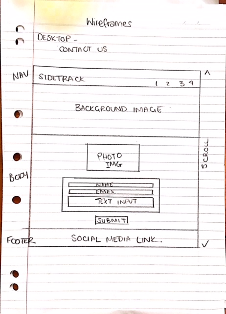

# User Centric Front-end Project- Milestone 1 Naomi Wickham

## Site can be viewed [Here]
https://blueag8.github.io/Sidetrack/index.html

## Link to C9 Development [Here]
https://ide.c9.io/blueag8/ucfd-project

## About
This website is for the flute and guitar duo “Sidetrack” to showcase their music
and publicise their availability to perform at events. Users can also contact the duo
to enquire about availability or upcoming performances. 

## UX

The duo’s primary target audiences are their “family, friends and other fans” 
who wish to keep abreast of our gigs, past and upcoming. 
They would like to showcase their music and publicise their availability to perform at events
such as weddings, funerals and dinner parties.

They wish to include:

- Photos of performances
- Some video clips
- Some audio clips to demonstrate their diversity of repertoire
- A list of current repertoires
- An option to promote additions to the repertoire

In addition, the website should promote live music in Port Adelaide, in particular

- The Railway Hotel – Port Adelaide
    www.railwayhotelportadelaide.com/
- Michonne Wine Bar: Michonne - Reds, Whites and Bites
    www.michonne.com.au/

### Wireframes

## Features

- Striking Image to capture attention used as background Imagery
- Easy Navigation including "back to top" link 
- Links to external websites
- Contact us Form to contact band regarding availabilities and performances
- Image Carousel
- Video for a soundclip sample
- Mobile responsive design

### Features left to implement

- Facebook page is yet to be set up so link is currently back to the index page
- Additional soundclips
- Repertoire list
- Upcoming performances list
- Contact us form to be linked to external server for posting 
- Ensure website is responsive for tablet users 

## Technologies used

Base languages used to create website include HTML, CSS and JavaScript

###	JQuery to support the implementation of JavaScript and Bootstrap
 https://code.jquery.com/jquery-3.2.1.min.js
https://maxcdn.bootstrapcdn.com/bootstrap/3.3.7/js/bootstrap.min.js

###	Bootstrap framework for main Navigation and layout
https://maxcdn.bootstrapcdn.com/bootstrap/3.3.7/css/bootstrap.min.css

###	Carousel- Bootstrap used to implement image carousel on performances page
https://www.w3schools.com/bootstrap/bootstrap_carousel.asp

###   Bootstrap-Font Awesome used for facebook social media link icon
https://stackpath.bootstrapcdn.com/font-awesome/4.7.0/css/font-awesome.min.css

###	Google fonts- Monoton Font used to create band logo. 
https://fonts.googleapis.com/css?family=Monoton

###	Hover css used to animate navigation
https://cdnjs.cloudflare.com/ajax/libs/hover.css/2.3.1/css/hover-min.css

## Testing 

### Responsive Design Mobile First
Site viewed and tested using 
Mobile 
- Samsung Galaxy 
- iphone 6

Desktop (Devtools)
- Chrome
- Internet Explorer

Collapse Navigation Bar for mobile design, Responsive Images to scale to fit viewport, Stack vertically affiliate links
on Performance page, Ensure links work. 

### Navigation
    Ensured links to pages including external websites weren't broken 
    External links open in new tab

### Contact Us Form 
    Submitted the empty form to verify that an error message about the required fields appears
    link opens to compose email on users browser

    
### Soundclip 
    Ensured video will play on multiple browsers
    Ensured there are controls to play video active
    
    
### Difficulties/issues encountered

1. Background Image disappearing and not scaling 
2. Carousel animation jumping
3. Social Media links not lining up
4. Images not responding when change in viewport ie desktop to mobile view
5. After feedback from a fellow student It Was pointed out that it was not obvious
  to the user when a page change had occured without seeing the URL or 
  scrolling down the page.
6. Animation causing page to jump

#### Solutions

1. Removed the background image filepath from the Css Style sheet and put it into 
   the html for each page. I also resized the original image.
2. Resized the performances images using tinyjpg.com and re-saved into cloud9.
   I adjusted the carousel-inner styles by giving a new height and in addition
   targeted the carousel-inner item image with adjusting the height and margin top.
3. The Facebook icon had a different alignment to the other two links because they were
   classed as img-circle. To amend this issue I removed the margin-top from the 
   img-circle class and I styled the .fa class with vertical-alignment middle.
4. this was a matter of adjusting the media qeuries 
5. To maintain the consistancy of the website the background and navigation was 
   kept the same. To make it more obvious to the user that the webpage has changed
   an opaque animation was added which slides up the page on load. 
6. I found that after a suggestion from one of the mentors that I needed to wrap rows 
   and columns with a container for bootstrap.  I edited the html to ensure that 
   I had containers around my rows. This seemed to adjust some of the layout. 
   I also adjusted the values for the Main properties and this seemed to help 
   reduce the appearance of the jumping when the opaque overlay is being animated.

## Deployment
Site deployed using Github

Initially the background images disappeared when deployed through Github however,
this was rectified with a correction to the image filepath. 

I had to re-edit the background colours to ensure they had fallback colour codes and 
I also discovered that I  must have reverted to an earlier version of my repository 
and the opaque white background which loads with page, had disappeared which not only
made it difficult again for the user to see the page change but also difficult to read
the black font on a dark background. 

## Credits

### Content

    Content supplied by “Sidetrack” - Catherine Jamieson

### Media 

	The photos used in this site were obtained from the duo. 
	Professional photography by Henk De Weerd
	Background image on the performances page only has been used from a third party with credit to
	https://www.pexels.com/photo/acoustic-guitar-gerritt-tisdale-guitar-martin-guitar-938489
	Treble Clef image using code on About page from:
	http://www.codetable.net/decimal/119070
    Images resized and converted to PNG thanks to:
    https://tinyjpg.com/
    Copyright Symbol
    https://webmasters.stackexchange.com/questions/29682/how-do-i-add-the-copyright-symbol-to-my-webpage

## Acknowledgements

Mentor
- Antonio Rodriguez 

CodeInstitute
- In particular "Bootstrapping Your Next Big Idea"

Slack
- Kevin Curtis, Jo Wings, Mormoran, Eventyret_Mentor, JohnL3,
- E.Fred, ShaneMuir_lead
